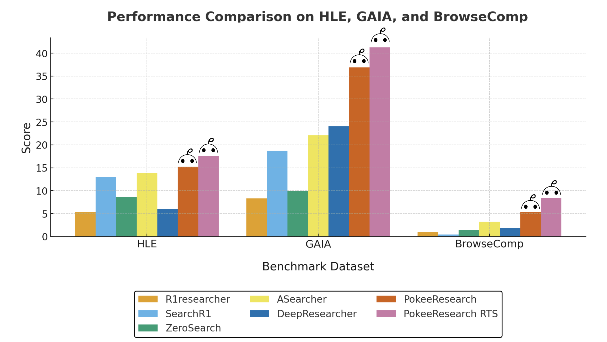
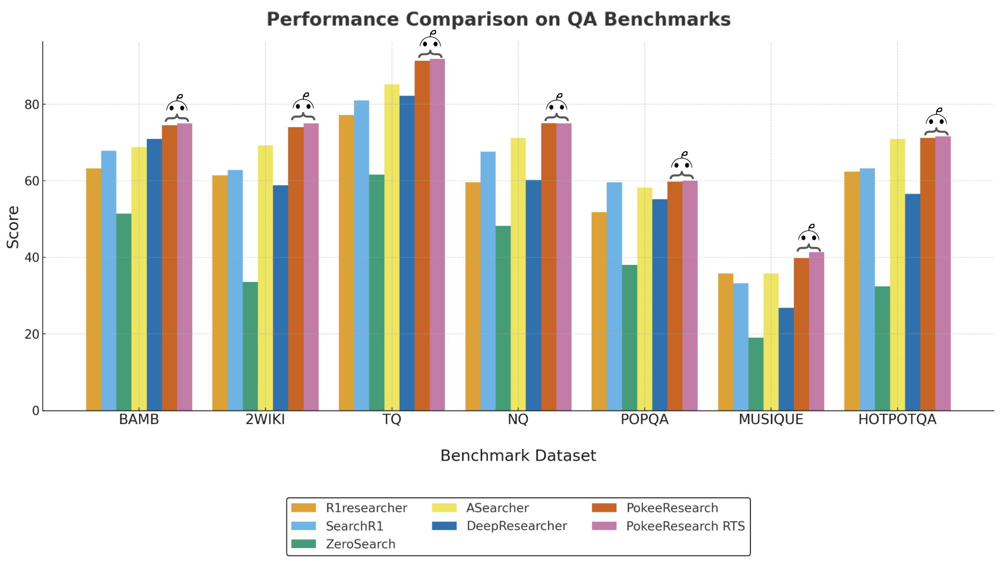

This repository hosts Pokee’s state-of-the-art 7B DeepResearch Agent, which integrates web search and content reading capabilities to answer complex questions using the most up-to-date information available online.

*We also offer an API hosting our proprietary deep research agent, which is up to 75% cheaper than OpenAI, Gemini, and Perplexity. It delivers comprehensive, citation-rich research reports with no hidden costs and no API key management required. (For more information about the API, visit [pokee.ai/deepresearch-preview](https://pokee.ai/deepresearch-preview))*

<div align="center">

[](https://github.com/Pokee-AI/PokeeResearchOSS)
[](https://arxiv.org/pdf/2510.15862)
[](https://huggingface.co/PokeeAI/pokee_research_7b)

[](https://linkedin.com/company/pokee-ai)
[](https://x.com/pokee_ai)
[](https://discord.gg/VJXWQvyd)
[](https://i.postimg.cc/wv099v5w/wechat-group-pokee.jpg)


<p style="text-align:center;">
  <a href="https://pokee.ai" target="_blank" rel="noopener noreferrer"><strong>pokee.ai</strong></a>
</p>

</div>

# PokeeResearch-7B Agent

Pokee's state-of-the-art 7B DeepResearch Agent that leverages web search and content reading capabilities to answer complex questions using the most up-to-date information available online.
<div align="center">

</div>
<div align="center">

</div>

## 🚀 Features

- **Multi-turn Research**: Performs iterative web searches and content analysis
- **Tool Integration**: Seamlessly integrates web search, content reading, and browsing tools
- **Comprehensive Evaluation**: Includes benchmark evaluation across multiple QA datasets
- **High Performance**: Achieves superior results on complex reasoning tasks
- **Scalable Architecture**: Built on efficient 7B parameter model for optimal performance


## 📋 Requirements

### Software
- Python 3.10 or newer with `pip`
- Git (for cloning this repository and submodules)
- `llama-cpp-python` (installed during setup)
- Optional: CUDA-enabled PyTorch if you plan to run training/evaluation scripts with Transformers

### Hardware
- CPU with AVX2 support (required by llama.cpp)
- Optional NVIDIA GPU for faster inference or training workloads

### API Keys
You will need the following API keys:
- **Serper API**: For web search functionality
- *(Optional)* **Gemini API**: Only if you intend to run the reward evaluation / training pipeline that still relies on Gemini judges


## 🛠️ Quick Start

### 1. Clone & Environment Setup
```bash
git clone https://github.com/Pokee-AI/PokeeResearchOSS.git
cd PokeeResearchOSS

# (Recommended) create an isolated environment
python3 -m venv .venv
source .venv/bin/activate  # Windows: .venv\Scripts\activate

python -m pip install --upgrade pip
python -m pip install -r requirements.txt
```


Create a `.env` file in the project root and add your API keys:
```bash
SERPER_API_KEY=your_serper_api_key_here
SUMMARY_GGUF_PATH=./models/summary/Qwen3-4B-Instruct-2507-q6_k_m.gguf
# Optional: only needed for reward evaluation
# GEMINI_API_KEY=your_gemini_api_key_here
# Optional overrides for the local summariser
# SUMMARY_THREADS=8
# SUMMARY_GPU_LAYERS=16
# SUMMARY_MAX_NEW_TOKENS=512
# SUMMARY_N_CTX=32768
```

### 1a. Prepare the summariser GGUF
Download the Qwen3-4B-Instruct GGUF we ship our prompts with and point `SUMMARY_GGUF_PATH` to it:
```bash
mkdir -p models/summary
cd models/summary
# Qwen 3 4B Instruct (2025-07) quantised to q6_k_m
wget https://huggingface.co/Mungert/Qwen3-4B-Instruct-2507-GGUF/resolve/main/Qwen3-4B-Instruct-2507-q6_k_m.gguf
cd -
```
Adjust the path in your environment variables if you store the file elsewhere.

### 1b. Download the PokeeResearch-7B GGUF (for llama.cpp serving)
```bash
mkdir -p models/pokee
cd models/pokee
# PokeeResearch 7B quantised to q4_k_m
wget https://huggingface.co/Mungert/pokee_research_7b-GGUF/resolve/main/pokee_research_7b-q4_k_m.gguf
cd -
```
Use the downloaded file when launching the CLI with `--model-path`.

### 2. Launch the Deep Research Agent App
We provide both a CLI app and a GUI app based on [Gradio](https://www.gradio.app/).
#### CLI App
> ❗️
> Before the CLI can answer questions you must (1) set the required environment variables and (2) start the tool server.

1. Export the required environment variables (or place them in `.env` as shown above):
   ```bash
   export SERPER_API_KEY=<your_serper_api_key>
   export SUMMARY_GGUF_PATH=./models/summary/Qwen3-4B-Instruct-2507-q6_k_m.gguf
   # Optional performance tweaks
   export SUMMARY_THREADS=2
   export SUMMARY_GPU_LAYERS=16
   ```
2. Launch the tool server (choose a port if the default 8888 is taken):
   ```bash
   python start_tool_server.py --enable-cache --port 8888
   ```
   Leave this process running; the CLI reads the port from `.server_port` automatically.
3. In a new terminal, run the CLI with llama.cpp:
   ```bash
   python cli_app.py --serving-mode llamacpp \
     --model-path ./models/pokee/pokee_research_7b-q4_k_m.gguf \
     --llama-threads 2
   ```

   *Summaries are generated locally via llama.cpp using your `SUMMARY_GGUF_PATH`. Adjust behaviour with `SUMMARY_THREADS`, `SUMMARY_GPU_LAYERS`, `SUMMARY_MAX_NEW_TOKENS`, and `SUMMARY_N_CTX` as needed.*

We provide both a single-query mode and an interactive mode to use the CLI app.
```
python cli_app.py            # interactive mode
python cli_app.py --question "<QUERY>"  # single query
```
Some additional options include
- `--verbose`  print the intermediate steps
- `--max-turns` set the max number of turns (default 10)
You can also tweak llama.cpp-specific flags such as `--llama-n-ctx`, `--llama-gpu-layers`, or `--llama-max-new-tokens` for your hardware.

#### GUI App
First, you need to install Gradio.
```bash
pip install --upgrade gradio
```
You don't need to launch a tool server in advance like in the CLI app. 
You will configure the credentials and start the tool server using the GUI once it's up.
Then, the app will spawn a tool server as a subprocess.
Launch the GUI app with
```bash
python gradio_app.py --serving-mode llamacpp
```
Some additional options include
- `--serving-mode` specify the model serving mode (set to `llamacpp` unless you re-enable the Transformers backend)
-  `--port` specify the port the Gradio app runs on

## 📊 Benchmark Dataset

Our benchmark dataset includes data from 10 common deep research benchmarks:
- **125 text-only questions** randomly selected from:
  - TQ, NQ, HotpotQA, PopQA, Musique, 2Wiki, Bamboogle, Browsecomp, and HLE
- **103 GAIA text-only questions**

This diverse dataset ensures comprehensive evaluation across various question types and domains, providing a robust assessment of the agent's capabilities.

## 🏆 Performance Results

| Method | HLE | GAIA | BrowseComp | BAMBOOGLE | 2WIKI | TQ | NQ | POPQA | MUSIQUE | HOTPOTQA |
|--------|-----|------|------------|----|----|-------|---------|----------|-----------|-------|
| R1researcher | 5.4 | 8.3 | 1.0 | 63.2 | 61.4 | 77.2 | 59.6 | 51.8 | 35.8 | 62.4 |
| SearchR1 | 13.0 | 18.7 | 0.4 | 67.8 | 62.8 | 81.0 | 67.6 | 59.6 | 33.2 | 63.2 |
| ZeroSearch | 8.6 | 9.9 | 1.4 | 51.4 | 33.6 | 61.6 | 48.2 | 38.0 | 19.0 | 32.4 |
| ASearcher | 13.8 | 22.1 | 3.2 | 68.8 | 69.2 | 85.2 | 71.2 | 58.2 | 35.8 | 71 |
| DeepResearcher | 6.0 | 24.0 | 1.8 | 71 | 58.8 | 82.2 | 60.2 | 55.2 | 26.8 | 56.6 |
| **PokeeResearch** | **15.2** | **36.9** | **5.4** | **74.5** | **74.0** | **91.3** | **75.1** | **59.8** | **39.8** | **71.4** |
| **PokeeResearch-RTS** | **17.6** | **41.3** | **8.4** | **75.0** | **75.0** | **91.8** | **75.0** | **60.0** | **41.4** | **71.6** |


*Table 1: Performance comparison across multiple benchmarks. PokeeResearch agent achieves state-of-the-art results across all benchmark datasets. For each question, 4 responses are generated. The agent's predicted answer is compared to the ground truth by Gemini-2.5-Flash-lite, which determines correctness. The accuracy over 4 responses across all questions by datasource is shown in the table.*

## Citation
```
@article{pokee2025deepresearch,
  title={PokeeResearch: Effective Deep Research via
          Reinforcement Learning from AI Feedback and Robust Reasoning Scaffold},
  author={Yi Wan* and Jiuqi Wang* and Liam Li
          and Jinsong Liu and Ruihao Zhu and Zheqing Zhu},
  journal={Pokee AI Technical Report},
  year={2025},
  url={https://arxiv.org/pdf/2510.15862}
}
```

## 📄 License

This project is licensed under the Apache 2.0 license - see the LICENSE file for details.

## 📞 Support

For questions and support, please open an issue in this repository.
